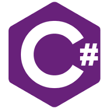

# Tech Vlog
1. CSharp
	1. Variables
	1. Types
	1. 크기와 범위
2. Unity
	- _Editor_
		- **Transform**
3. Mathmatics
	- Vector

\



>MarkDown

| ID | Name | Release |
| --- | --- | --- |
| 1 | Unity | 2005.06.01 |
| 2 | C# | 2000.01.01 |
| 3 | Visual Studio | 1997.11.19 |

>HTML Table
<table>
	<tr>
		<td>ID</td>
		<td>Name</td>
		<td>Number</td>
	</tr>
	<tr>
		<td>1</td>
		<td>Unity</td>
		<td>10</td>
	</tr>
	<tr>
		<td>2</td>
		<td>C#</td>
		<td>100</td>
	</tr>
	<tr>
		<td>3</td>
		<td>Visual Studio</td>
		<td>30</td>
	</tr>
</table>

>Code Block
```csharp
using System;
if(test == true)
{
    Debug.Log("Test");
}
```
>피타고라스 정리에 대해
